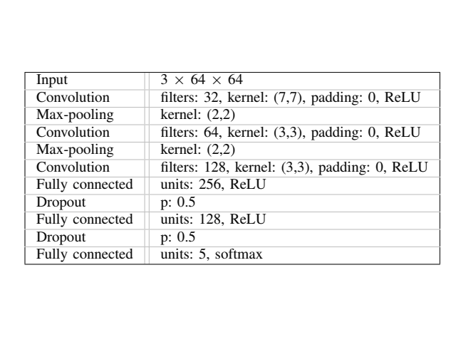

## Final Project of Self-Driving Car Nanodegree Course

## Goal

The goal of this project is to implement an application capable of driving a car using given inputs and outputs in 
the simulator and on the real track.

The inputs include track waypoints, pose, velocity, camera image.
The outputs consist of steering, break and throttle.

The application should be implemented as a set of ROS nodes and run in ROS environment.

## Architecture

The required architecture in terms of ROS nodes is presented in the following picture.


ROS part contains 6 nodes. Some of the nodes were already implemented and one node implementation
was not supported by the simulator eventually.

```
1. Obstacle detection       - not supported by the simulator
2. Traffic ligth detection  - need to implement
3. Waypoint loaded          - implemented
4. Waypoint updater         - need to implement
5. Drive by wire            - need to implement
6. Waypoint follower        - implemented with simple pursuit algorithm

``` 

## Nodes implementation

### 1. Waypoint loader

This node was already implemented.
It doesn't subscribe for any topic.
It outputs
```
/base_waypoints - list of all waypoints on the track (updated once)
```

The goals of this node:

1. Load waypoints and maximum allowed velocity value.
2. Publish waypoints so they are available to other nodes.


### 2. Waypoint follower

This node was already implemented. 
The nodes subscribes for
```
/final_waypoints - list of waypoints with assigned velocity the car should follow (50Hz)
```
and outputs
```
/twist_cmd - proposed veolicity (50Hz)
```

The node contains an open source implementation of pure pursuit algorithm.
The goals are:

1. Calculate velocity needed to follow /final_points and keep proposed velocity
2. Publish calculated velocity to /twist_cmd

### 3. Obstacle detection

Obstacles are not supported by the simulator so this node is not applicable.

### 4. Waypoint updater 

The node subscribes for

```
/pose                - current car's pose (50Hz)
/velocity            - current car's velocity (50Hz)
/traffic_waypoint    - index of next stopping waypoint (10Hz)
/base waypoints      - list of all waypoints (updated once)
/vehicle/dbw_enalbed - whether automated driving is enabled (update on demand) 
```

and outputs

```
/final waypoints   - list of waypoints the car needs to follow (50Hz)
```

##### The goals are:

1. Find a number of points ahead of the car.
2. Calculate velocities of each waypoint in such a way that they
    - don't go above maximum velocity
    - provide deceleration in case and stop if /traffic_waypoint requires so
    - provide acceleration to maximum velocity if there is no /traffic_waypoint published
    
3. Assign velocities to corresponding wayponts and publish them to /final_waypoints so waypoints follower could use them.


##### Implementation details:

1. There are approximately 10000 points in the sim waypoints list. To reduce search time the search of the closest
point is done withing some horizon from the previous point. In case of /vehicle/dbw_enabled switching the previous point is reset
to zero and search is done from the beginning.

2. In case the car misses a stop point it will still try to stop unless it is able
to observe red light.

4. Velocities are assigned according to the following equation:
```
v = sqrt(current_velocity^2 + 2 * given_acceleration * distance_to_point)
```   


### 5. Drive by wire

The node subscribes for

```
/current_velocity    - current car's velocity (50Hz)
/twist_cmd           - velocity proposed by waypoint follower (50Hz)
/vehicle/dbw_enabled - whether automated driving is enabled (update on demand)
```

and outputs

```
/vehicle/throttle_cmd - (50Hz)
/vehicle/steering_cmd - (50Hz)
/vehicle/brake_cmd    - (50Hz)
```

##### The goals are:

1. Calculate driving commands (acceleration, brake, steering angle) out of current car velocity and velocity proposed by waypoint follower.
2. Publish calculated commands to the vehicle.
3. Reset needed values in case driving by wire was switched.

##### Implementation details:

1. Acceleration/deceleration is calculated with PID controller.
2. Steering angle is calculated with provided code and smoothed using low pass filter.
3. Controllers are reset when /vehicle/dbw_enable is enabled 

### 6. Traffic light detection 


The node subscribes for:

```
/base_waypoints         - list of all waypoints (updated once)
/image_color            - color image of the space ahead of the car (10Hz)
/current_pose           - current pose of the car (50Hz)
/vehicle/traffic_lights - list of all traffic lights locations (50Hz)
```

and outputs

```
/traffic_waypoint - index of waypoint corresponding to a stop line where the car should stop
```

##### The goals are:

1. Find the next traffic light ahead of the car and its stop line.
2. Classify traffic light state using color image.
3. Publish stop line waypoint in case needed so waypoint updater could use it to assign deceleration/acceleration to /final_points

##### Implementation details:

1. Traffic light classification is implemented using two steps: detection and classification.
2. Traffic light detection is implemented using tensorflow's pretrained [faster rcnn based on resnet100](https://github.com/tensorflow/models/blob/master/research/object_detection/g3doc/detection_model_zoo.md). No fine tuning was done for detection improvement.
3. Classification of detected sub images is done using a simple network from a paper ["A Deep Learning Approach to Traffic Lights: Detection, Tracking, and Classification"](http://ieeexplore.ieee.org/document/7989163/).
It is trained on [Boshc dataset](https://hci.iwr.uni-heidelberg.de/node/6132), images collected in the simulator and from ROS bag provided on the project page. It classifies images into 4 categories: 
```
* red
* yellow
* green
* unknown
```



4. Combined detection/classification operation takes approximately 0.2-0.25 seconds on my machine which is quite slow,
so I had to put the pipeline into a dedicated thread.
5. Multiple traffic lights can be detected. The following simplified rule is used to get a single classification for the whole image:
    * In case at least one red light detected, the overall classification result is red
    * If no red lights detected, then if at least one yellow light is detected, then the overall result is yellow
    * If no red/yellow lights detected, then if at least one green light is detected the overall result is green.
    * Otherwise the result is unknown.  
6. To reduce noise a traffic light state is considered reliable when it is detected on 3 images in a row. This raises reaction time to approximately 1 second.

7. Lights are interpreted differently when observed before and after stop line. In case yellow light is observed before the stop line
it is considered as a stop sign. In case yellow or green lights are observed after stop line the car is allowed to continue even
if it observes red light after that.  

---

## Results

* As required the implemented application is able to drive the car in the simulator along waypoints
and stop at traffic lights. Though it is not clear how it would behave on the real car.

##### Illustration

* Simulator


* Site


## Reflections

* It was a good introduction to ROS. Looks like the philosophy of ROS encourages design of small independent modules.
* Probably path planning can be improved by smoothing trajectories.
* It is not clear whether it is possible to embed the object detector used in this implementation into a real car. Currently reaction time is about a second which is pretty slow.
* On the other hand the detector does detection of 90 kinds of objects at the moment, so this implementation can be extended to detect a lot of things.
* Detection and classification show decent results, but still both networks need to be retrained on more data, especially the detector. May be cityscapes can be used for this.
* I guess that for real world application more complex detection and classification is needed.
Probably it is also needed to learn distance and orientation of traffic lights and other objects.   

---

### Installation 

* Be sure that your workstation is running Ubuntu 16.04 Xenial Xerus or Ubuntu 14.04 Trusty Tahir. [Ubuntu downloads can be found here](https://www.ubuntu.com/download/desktop). 
* If using a Virtual Machine to install Ubuntu, use the following configuration as minimum:
  * 2 CPU
  * 2 GB system memory
  * 25 GB of free hard drive space
  
  The Udacity provided virtual machine has ROS and Dataspeed DBW already installed, so you can skip the next two steps if you are using this.

* Follow these instructions to install ROS
  * [ROS Kinetic](http://wiki.ros.org/kinetic/Installation/Ubuntu) if you have Ubuntu 16.04.
  * [ROS Indigo](http://wiki.ros.org/indigo/Installation/Ubuntu) if you have Ubuntu 14.04.
* [Dataspeed DBW](https://bitbucket.org/DataspeedInc/dbw_mkz_ros)
  * Use this option to install the SDK on a workstation that already has ROS installed: [One Line SDK Install (binary)](https://bitbucket.org/DataspeedInc/dbw_mkz_ros/src/81e63fcc335d7b64139d7482017d6a97b405e250/ROS_SETUP.md?fileviewer=file-view-default)
* Download the [Udacity Simulator](https://github.com/udacity/CarND-Capstone/releases/tag/v1.2).

### Usage

1. Install python dependencies
```bash
cd CarND-Capstone
pip install -r requirements.txt
```
2. Make and run styx
```bash
cd ros
catkin_make
source devel/setup.sh
roslaunch launch/styx.launch
```
4. Run the simulator

### Real world testing
1. Download [training bag](https://drive.google.com/file/d/0B2_h37bMVw3iYkdJTlRSUlJIamM/view?usp=sharing) that was recorded on the Udacity self-driving car (a bag demonstraing the correct predictions in autonomous mode can be found [here](https://drive.google.com/open?id=0B2_h37bMVw3iT0ZEdlF4N01QbHc)) 
2. Unzip the file
```bash
unzip traffic_light_bag_files.zip
```
3. Play the bag file
```bash
rosbag play -l traffic_light_bag_files/loop_with_traffic_light.bag
```
4. Launch your project in site mode
```bash
cd CarND-Capstone/ros
roslaunch launch/site.launch
```
5. Confirm that traffic light detection works on real life images
